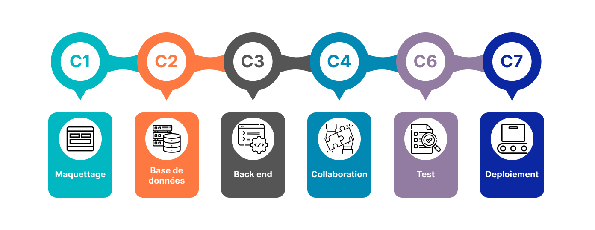

# Compétences cibles

*figure: Compétences cibles*

<!-- note -->

Développer une application web qui répond aux 6 compétences visées du référentiel :
- **C1 Maquettage** : Maquetter une application mobile.
- **C2 Base de données** : Manipuler une base de données - perfectionnement.
- **C3 Back end** : Développer la partie back-end d’une application web ou web mobile - perfectionnement.
- **C4 Collaboration gestion de projet** : Collaborer à la gestion d’un projet informatique et à l’organisation de l’environnement de développement - perfectionnement.
- **C6 Test** : Préparer et exécuter les plans de tests d’une application.
- **C7 Deploiement** : Préparer et exécuter le déploiement d’une application web et mobile - perfectionnement.

download file Competences.fig :
 - [Competences](./competences.fig "download")

<!-- new slide -->