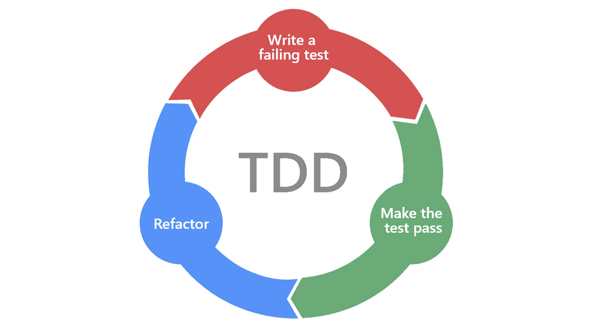

# Exposé TDD

{:width="700px"}*figure: TDD*

<!-- note -->

TDD, ou Test-driven development, est une approche de développement de logiciels où l'on écrit des tests pour son code avant même d'écrire le code en lui-même. Le processus comprend généralement trois étapes principales :

- Écrire un Test : On commence par écrire un test qui décrit une petite fonctionnalité que l'on souhaite implémenter.

- Exécuter le Test : Initialement, le test devrait échouer car la fonctionnalité n'a pas encore été implémentée.

- Écrire le Code : Ensuite, on écrit le code le plus simple possible pour faire passer le test.

- Refactoriser : Une fois que le test passe, on peut retravailler le code pour en améliorer la structure ou l'efficacité, tout en veillant à ce que tous les tests réussissent toujours.

## Références

### Lien de Présentation
[https://labs-web.github.io/prototype/Exposé-TDD/présentation.html](./Exposé-TDD/présentation.html)

### Lien de Rapport
[https://labs-web.github.io/prototype/Exposé-TDD/rapport.html#/](./Exposé-TDD/rapport.html)  

<!-- new slide -->
