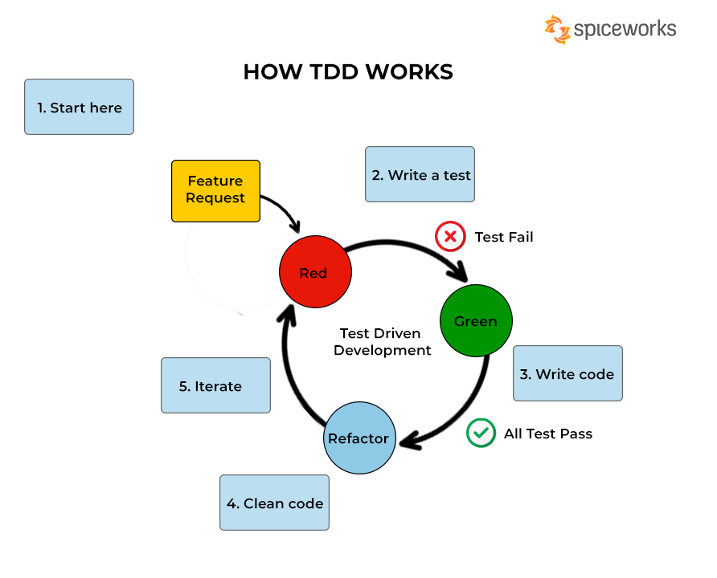

# Test-driven development (TDD)
{:class="sectionHeader"}

<!-- new slide -->

# Introduction
{:width="700px"}*figure: TDD*

<!-- new slide -->

## comment il fonction

{:width="700px"}*figure: TDD*
