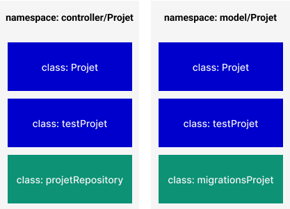

# Exposé name space

{:width="700px"}*figure: Name space*

<!-- note -->

Les espaces de noms sont des qualificatifs qui résolvent deux problèmes différents :

1. Ils permettent une meilleure organisation en regroupant les classes qui travaillent ensemble pour effectuer une tâche
2. Ils permettent d’utiliser le même nom pour plus d’une classe.

Par exemple, vous pouvez avoir un ensemble de classes qui décrivent un tableau HTML, comme Tableau, Ligne et Cellule tout en ayant également un autre ensemble de classes pour décrire les meubles, tels que Table, Chaise et Lit. Les espaces de noms peuvent être utilisés pour organiser les classes en deux groupes différents tout en empêchant les deux classes Table et Table d’être mélangées.

## Références

### Lien de Présentation
[https://labs-web.github.io/prototype/exposé-name-space/rapport.html](./Exposé-name-space/présentation.html)

### Lien de Rapport
[https://labs-web.github.io/prototype/exposé-name-space/présentation.html#/](./Exposé-name-space/rapport.html)  

<!-- new slide -->
