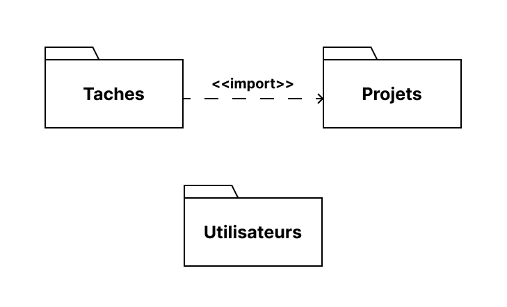

# Conception
{:class="sectionHeader"}

<!-- new slide -->

## Diagramme de class

{:width="900px"}*figure: diagramme de class*

<!-- note -->

download file diagramme classes :
 - [Competences](/prototype/conception/diagramme-classes.moo "download")

<!-- new slide -->

## Diagramme de packages

{:width="900px"}*figure: Diagramme de packages*

<!-- note -->

- Package **Projets** : Il s'agit d'un package (ou module) au sein du système logiciel qui contient vraisemblablement des classes de modèle et de contrôleur, des éléments de base de données, des interfaces ou d'autres composants liés à des projets.
- Package **Taches** : Il s'agit d'un package (ou module) au sein du système logiciel qui contient vraisemblablement des classes de modèle et de contrôleur, des éléments de base de données, des interfaces ou d'autres composants liés à des tâches.
- Package **Utilisateurs** : Il s'agit d'un package (ou module) au sein du système logiciel qui contient vraisemblablement des classes de modèle et de contrôleur, des éléments de base de données, des interfaces ou d'autres composants liés à des utilisateurs.
- Relation : **<<import>>** : La relation "<<import>>" entre le package Taches et le package Projets signifie que le package Taches importe des éléments du package Projets.

download file Diagramme de packages :
 - [Diagramme de packages](/prototype/Diagramme-de-packages/Diagramme-de-packages.fig "download")

<!-- new slide -->
