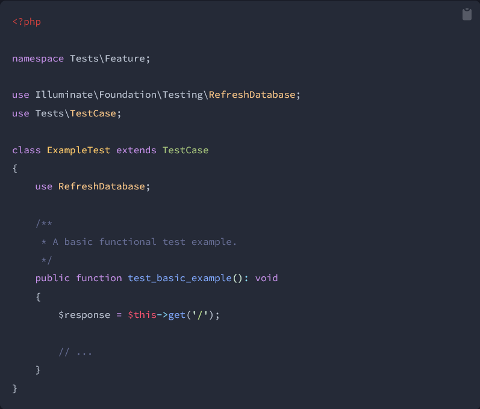

# Unit test

{:width="900px"}*figure: Unit test*

<!-- new slide -->

# Unit Testing Laravel

{:width="900px"}*figure: Unit Testing Laravel*

<!-- new slide -->

# Tests: Fonctionnels vs. Unitaires

{:width="900px"}*figure: tests fonctionnels et les tests unitaires*

<!-- new slide -->

# Création de tests

```shell
  php artisan make:test UserTest
```

```shell
  php artisan make:test UserTest --unit
```

<!-- new slide -->

# Exécution de tests

```shell
  ./vendor/bin/phpunit
```

```shell
  php artisan test
```

<!-- new slide -->

# Assertions disponibles

```shell
  $response->assertSuccessful();
```

```shell
  $response->assertStatus($code);
```

```shell
  $response->assertSee($value, $escaped = true);
```

```shell
  $response->assertDontSee($value, $escaped = true);
```

<!-- new slide -->

# Test de base de données

{:width="900px"}*figure: Test de base de données*

<!-- new slide -->

## Réinitialisation de la base de données

*figure: Réinitialisation de la base de données*

<!-- new slide -->

## Available Assertions

```shell
  $this->assertDatabaseCount('users', 5);
```

```shell
  $this->assertDatabaseHas('users', [
    'email' => 'sally@example.com',
  ]);
```


```shell
  $this->assertDatabaseMissing('users', [
    'email' => 'sally@example.com',
  ]);
```


<!-- new slide -->

# Conclusion 
{:class="sectionHeader"}


